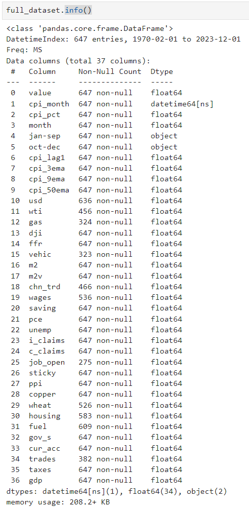

# BSE_DSM_Statisctic_project

## PROJECT OUTLINE:

## Data summary 

The Data mainly originated from [fred]([URL](https://fred.stlouisfed.org/)
and some additional sources like: 

[Manheim vehicle Index](https://site.manheim.com/en/services/consulting/used-vehicle-value-index.html)

[US trade balence](www.census.gov/)

was used

For every single covariate it was ensured that we have have no data leakage. Meaning that atleast 3 days before the CPI realease (2nd wednesday of every month) all our decision variables are available so that we can do Real Predictions of future cpi change.

in the end Our raw data had following structure

## Interpolation

Because some of our data wasnt available for the Early years of our time series, but we didnt want to throw away so many samples we had to interpolate the beginning of some datapoint. For that we chose following method:

1. Extract a sub-series from the input series for the years 2013 to 2019.
2. Calculate the mean of the values in this sub-series (vector_2013_2019).
3. Find the first valid index and its corresponding value in the input series.
4. Calculate the time frame between the first valid index and the year 2016.
5. Compute the gradient (rate of change) using the mean value and the first valid value over the time frame.
6. Determine the length of the portion of the series up to the first valid index.
7. Generate interpolated values using the gradient for the determined length.
8. Update the series up to the first valid index with the interpolated values

## Target (y) engeneering

BASKET_px = CPI basket price in month t

y = log(BASKET_px(t)) - log(BASKET_px(t-1))

## Train Test split

for validation purposes we used a 20% test split, even tho we have timeseries data, shuffling the data was not a problem as we only predict one timestamp in advance. (the log diffrence of the cpi basket for next month)
The autocorrelation is accountet for as we add t-1 cpi (target from prev timestep) as a controll variable

Random Intervals as Test set, should be fine even tho we have a Timeseries (we only predict 1 timestamp m/m)

## Feature Engeneering:

Problem: Very high correlation in Covariates
Problem: We have an autocorrelated timeseries, but put yt-1 as one of our input features for Xt should fix that 

## Part 1:
    Ols 
    Lasso with CV
    Ridge with CV
    Adaptive Lasso with CV
    Lasso with EBIC
    
    BMA
    Test all models on our test set
    
    
    
## Part 2:
    Use PCA and GMMs for dim reduction
    
    5 - 50 K for GMM 
    
    Try best method from part 1 again
